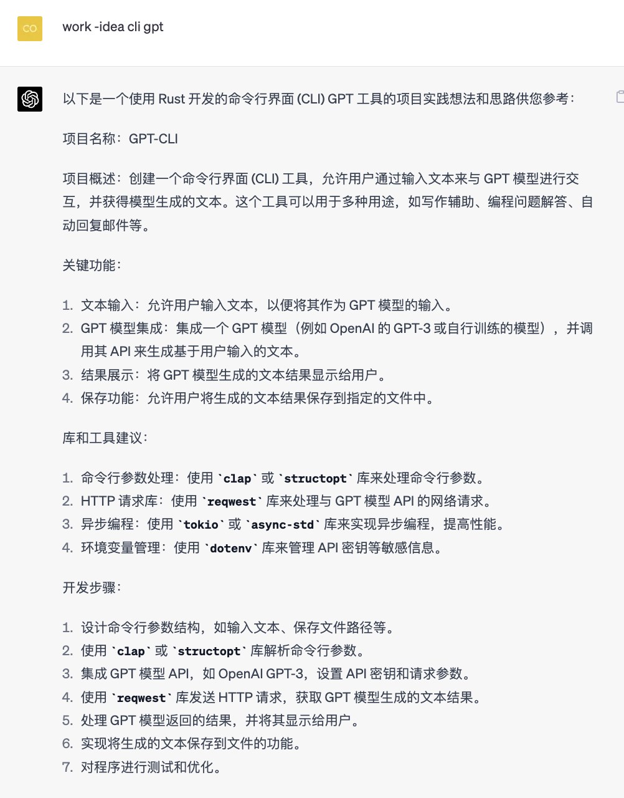
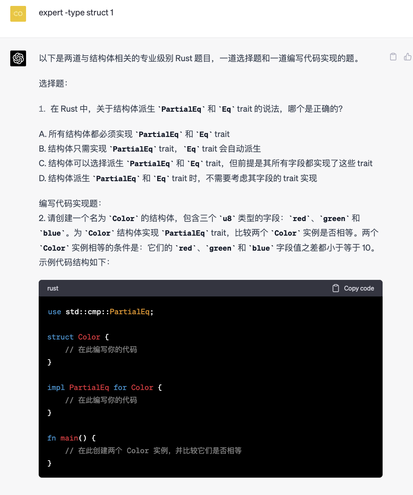
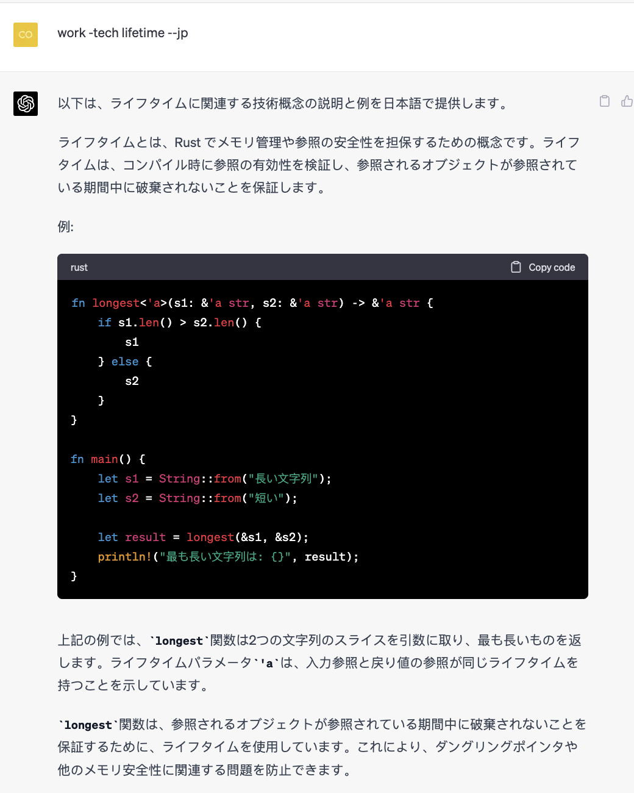
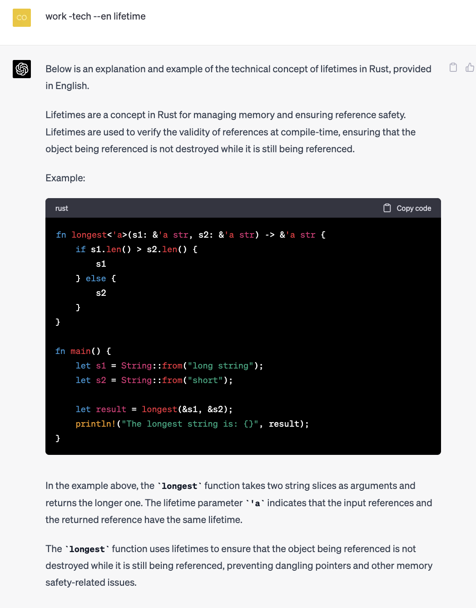

# RustChat

**Develop GPT as a "magic" system for assisting Rust learning.**

- [中文说明](https://mp.weixin.qq.com/s/DmsoAJZCWEEwUcoWhGFR9w
)
- [English Description]()

## Command System Table

| Main Instruction | Function                                                  |
| ---------------- | --------------------------------------------------------- |
| explain          | Provides detailed explanations for specified Rust code   |
| debug            | Helps find code bugs by following given compiler errors    |
| work             | Outputs questions that cover common Rust features and knowledge for beginners and daily usage |
| expert           | Outputs questions that cover Rust expert level features and knowledge |
| quiz             | Outputs questions that specifically cover confusing Rust language features |
| anwser           | Specifies the number of questions to be answered and provides explanations |

| First Level Instruction | Function                                                         |
| ----------------------- | ---------------------------------------------------------------- |
| -tech                   | Outputs explanations with relevant examples at the main instruction level |
| -type                   | Outputs questions at the main instruction level                    |
| -idea                   | Outputs project implementation ideas and practical guidance at the main instruction level |
| -crate                  | Only used with main instruction `work`, recommends relevant third-party crates |
| -n                      | Only used with main instruction `anwser`, specifies the number of questions to be answered and provides explanations |

| Second Level Instruction | Function                                  |
| ------------------------ | ----------------------------------------- |
| --cn                     | Outputs content in Chinese                |
| --en                     | Outputs content in English                |
| --jp                     | Outputs content in Japanese               |

## Example

